# Secure File Portal


> **Secure file sharing and access management system** built with **Django**, **PostgreSQL**, **Redis**, **Celery**, and **Nginx**.

---

## Author

**Name:** Adib  
**Role:** Senior Technical Operation Engineer  

---

## Table of Contents

- [1. Overview](#1-overview)
- [2. Key Features](#2-key-features)
- [3. High-Level Architecture](#3-high-level-architecture)
- [4. Core Services](#4-core-services)
- [5. Main Storage Paths](#5-main-storage-paths)
- [6. Main URLs](#6-main-urls)
- [7. User Roles](#7-user-roles)
- [8. Account Statuses](#8-account-statuses)
- [9. Authentication & Security Flows](#9-authentication--security-flows)
- [10. Registration Flow](#10-registration-flow)
- [11. Admin Portal Guide](#11-admin-portal-guide)
- [12. Web User Portal Guide](#12-web-user-portal-guide)
- [13. Email & OTP System](#13-email--otp-system)
- [14. Environment Variables](#14-environment-variables)
- [15. Deployment & First-Time Setup](#15-deployment--first-time-setup)
- [16. Storage Root & Scan Process](#16-storage-root--scan-process)
- [17. Branding & Static Files](#17-branding--static-files)
- [18. Useful Operational Commands](#18-useful-operational-commands)
- [19. Troubleshooting](#19-troubleshooting)
- [20. Security Notes](#20-security-notes)
- [21. Maintenance Checklist](#21-maintenance-checklist)
- [22. Post-Deployment Validation Checklist](#22-post-deployment-validation-checklist)

---

## 1. Overview

**Secure File Portal** is a web-based file sharing and access management platform designed for controlled internal and external access to files and folders.

It provides:

- email-based login
- OTP-based authentication
- admin-controlled user approval
- folder-level access control
- protected file downloads
- audit logging with Trace ID / journey tracking
- password expiry and password history control
- account unlock via security questions
- scheduled indexing of local and NAS storage

This document explains:

1. how to deploy and operate the portal
2. how administrators use the platform
3. how end users interact with the portal

---

## 2. Key Features

### Security
- email + password login
- OTP verification
- session timeout enforcement
- password expiry
- password history validation
- account blocking after repeated failures
- unlock workflow using security questions
- protected file access through Django authorization + Nginx internal redirect

### Administration
- approve or reject registered users
- create admin accounts
- disable, unblock, and re-enable users
- grant and revoke folder permissions
- create folders
- upload and delete files
- review audit trails and Trace IDs

### Operations
- background jobs with Celery
- periodic storage indexing
- email-based OTP and notification workflow
- structured deployment with containerized services

---

## 3. High-Level Architecture

### Main Components

#### Django Web App
Handles:
- authentication
- admin portal
- web user portal
- access control
- audit trail
- password and profile workflows

#### PostgreSQL
Stores:
- users
- profiles
- OTP data
- password history
- audit logs
- folder/file metadata
- folder permissions
- settings

#### Redis
Used for:
- Celery broker
- Celery result backend

#### Celery Worker
Handles background tasks such as:
- OTP email sending
- password reminder emails
- admin alert emails
- cleanup jobs
- storage scanning

#### Celery Beat
Runs scheduled tasks periodically.

#### Nginx
Handles:
- HTTPS reverse proxy
- static and media serving
- protected downloads via internal redirect

---

## 4. Core Services

The application stack contains these services:

- `db` → PostgreSQL 17
- `redis` → Redis 7
- `web` → Django + Gunicorn
- `celery` → background worker
- `celery-beat` → task scheduler
- `nginx` → reverse proxy and static/protected file handling

### `web` Container Startup Behavior

At startup, the `web` service automatically:

1. waits for the database
2. applies migrations
3. runs `collectstatic`
4. seeds security questions
5. runs `create_initial_superadmin`
6. starts Gunicorn

---

## 5. Main Storage Paths

The application uses two storage roots:

- `LOCAL_STORAGE_ROOT=/deployment/local`
- `NAS_STORAGE_ROOT=/deployment/nas`

These paths are scanned and indexed into the database.

---

## 6. Main URLs

### Authentication
- Login: `/auth/login/`
- Register: `/auth/register/`
- OTP Verification: `/auth/otp/`
- Unlock Account: `/auth/unlock/`
- Unlock OTP: `/auth/unlock/otp/`
- Expired Password Reset: `/auth/password/expired/`
- Logout: `/auth/logout/`

### Admin Portal
- Dashboard: `/admin-portal/`
- Users: `/admin-portal/users/`
- Create Admin User: `/admin-portal/create-admin/`
- Folders: `/admin-portal/folders/`
- Create Folder: `/admin-portal/folders/create/`
- Delete Folder: `/admin-portal/folders/delete/`
- Upload File: `/admin-portal/files/upload/`
- Delete File: `/admin-portal/files/delete/`
- Grant Folder Permissions: `/admin-portal/permissions/`
- Revoke Folder Permissions: `/admin-portal/permissions/revoke/`
- Audit Logs: `/admin-portal/logs/`
- Journey Detail: `/admin-portal/journey/<trace_id>/`

### Web User Portal
- Dashboard: `/portal/`
- Folder Detail: `/portal/folders/<folder_id>/`
- Download File: `/portal/download/<file_id>/`
- Profile: `/portal/profile/`
- Change Password: `/portal/password/change/`
- Forced Password Reset: `/portal/password/forced/`

---

## 7. User Roles

### 7.1 Super Admin
Highest privileged role.

Can:
- access full admin dashboard
- create admin users
- approve or reject web users
- disable, unblock, and re-enable users
- delete users
- create folders
- upload and delete files
- grant and revoke permissions
- review audit logs and journeys

### 7.2 Admin Read-only
Restricted admin role.

Intended for limited admin operations.  
Before production hardening, review final privilege boundaries carefully to ensure only the intended actions remain enabled.

### 7.3 Web User
Standard user role.

Can:
- self-register
- wait for approval
- log in with email + password + OTP
- browse authorized folders
- download authorized files
- manage profile and password
- use account unlock flow if blocked

---

## 8. Account Statuses

Common statuses used in the system:

- `PENDING_APPROVAL`
- `APPROVED`
- `BLOCKED`
- `SECURITY_BLOCKED`
- `DISABLED_PASSWORD_EXPIRED`
- `DISABLED_ADMIN`
- `REJECTED`
- `DELETED`

### Meaning Summary

- **Pending Approval** → registration submitted, waiting for admin action
- **Approved** → active and usable
- **Blocked** → blocked after repeated bad password attempts
- **Security Blocked** → blocked after failed security-answer flow
- **Disabled - Password Expired** → password expired and must be reset
- **Disabled by Admin** → manually disabled by admin
- **Rejected** → registration rejected
- **Deleted** → soft-deleted account

---

## 9. Authentication & Security Flows

### 9.1 Login Flow

1. user opens login page
2. user enters email and password
3. if credentials and account status are valid
4. OTP is generated and emailed
5. user enters OTP
6. login is completed
7. user is routed according to role

<details>
<summary><strong>📸 View Login Page Screenshot</strong></summary>

<br>

<p align="center">
  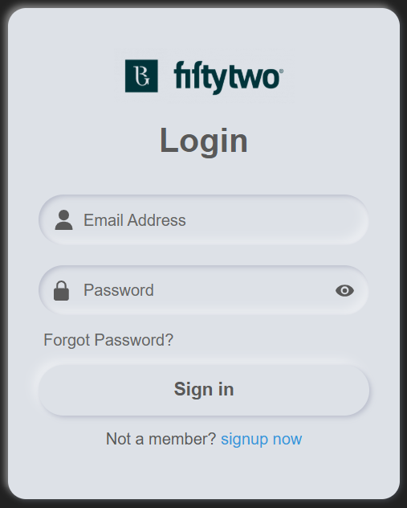
</p>

<p align="center">
  <em>Login page — central entry point for Admin & Web_users.</em>
</p>
</details>

### 9.2 Security Controls

The portal includes:

- OTP verification
- failed login counting
- automatic block after repeated failures
- session timeout middleware
- password expiry enforcement
- password history checks

<details>
<summary><strong>📸 View OTP Page Screenshot</strong></summary>

<br>

<p align="center">
  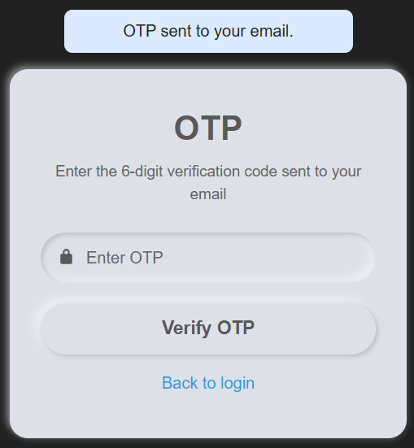
</p>

<p align="center">
  <em>OTP page — central 2FA OTP Security Controls for Admin & Web_users.</em>
</p>
</details>

### 9.3 Expired Password Flow

1. user submits valid email/password
2. portal detects password expiry
3. OTP is sent
4. user is redirected to expired password reset page
5. user sets a new password
6. user logs in again

### 9.4 Account Unlock Flow

1. open `/auth/unlock/`
2. enter email
3. answer three security questions
4. if correct, OTP is sent
5. verify OTP
6. account is unlocked

If the security answers fail repeatedly, the account may become `SECURITY_BLOCKED`.

<details>
<summary><strong>📸 View WEB Account Unlock Flow Screenshot</strong></summary>

<br>

<p align="center">
  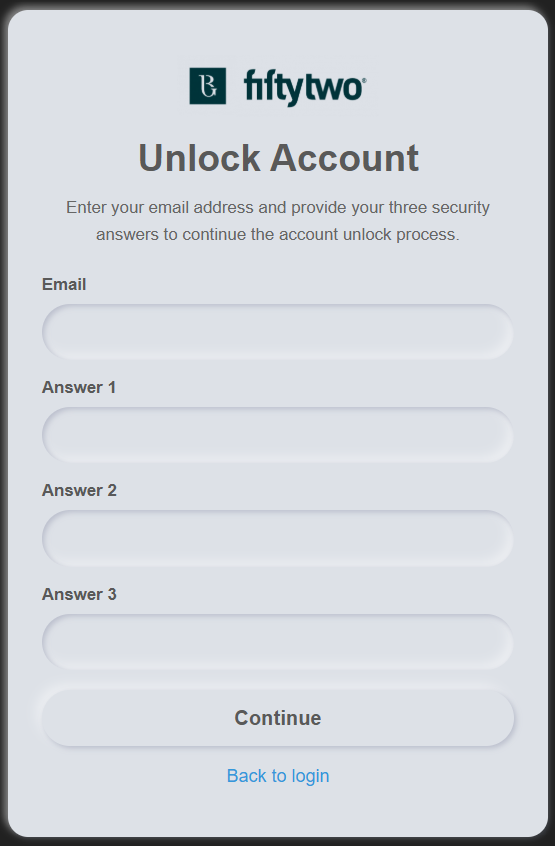
</p>

<p align="center">
  <em>Forgot Password page — Unlock Web_users via providing Login email and security questions answer.</em>
</p>
</details>

---

## 10. Registration Flow

### 10.1 Web User Registration

Users register from `/auth/register/`.

The form includes:

- full name
- email
- password
- confirm password
- three security questions
- three answers

### 10.2 After Registration

- account is created in pending state
- admin must approve it
- until approved, login access is not granted

<details>
<summary><strong>📸 View Registration Page Screenshot</strong></summary>

<br>

<p align="center">
  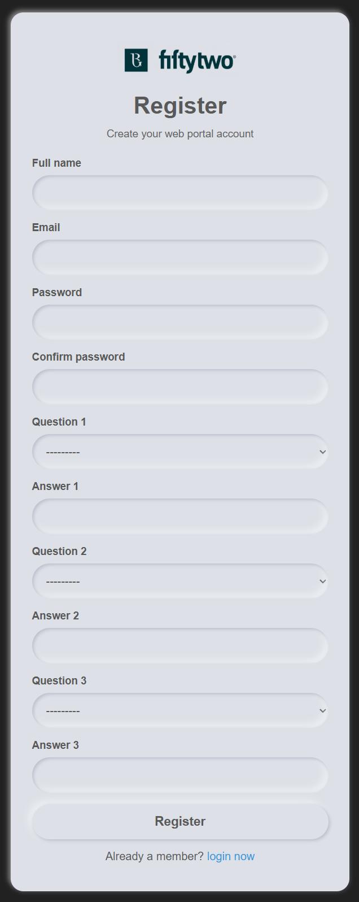
</p>

<p align="center">
  <em>Registration page — Web_users Registration page to get acces.</em>
</p>
</details>

---

## 11. Admin Portal Guide

### 11.1 Dashboard

The dashboard is the main navigation point for administrators.

It links to:

- Users
- Folders
- Grant Folder Permissions
- Revoke Folder Permissions
- Audit Logs

It also shows summary counts for:

- pending users
- web users
- admin users
- folders
- files

<details>
<summary><strong>📸 View Dashboard Screenshot</strong></summary>

<br>

<p align="center">
  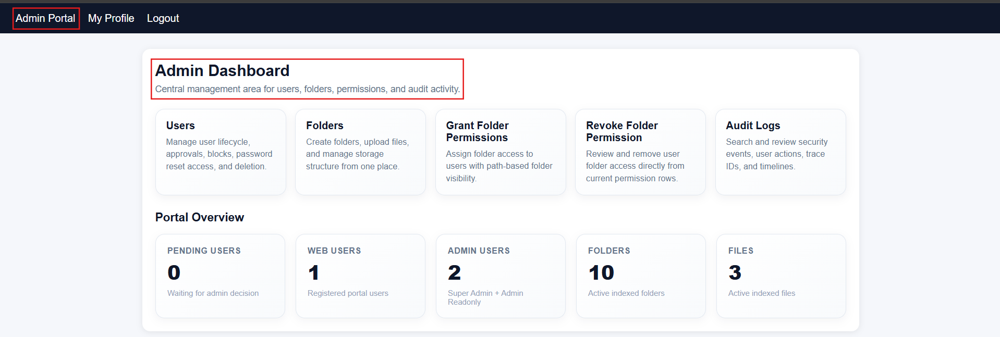
</p>

<p align="center">
  <em>Admin Dashboard — central entry point for portal administrators.</em>
</p>
</details>

### 11.2 Users Page

Purpose:
- manage users
- filter by status
- search by email
- approve, reject, disable, unblock, re-enable, delete

#### Common Actions

**Approve a pending user**
1. open Users
2. filter by `Pending Approval`
3. click `Approved`

**Reject a pending user**
1. open Users
2. filter by `Pending Approval`
3. click `Reject`

**Disable an approved user**
1. filter by `Approved`
2. click `Disabled`

**Set a temporary password / re-enable user**
1. find blocked, expired, or disabled user
2. click `Temp Password`
3. a temporary password is set
4. user must change password after login

**Delete a web user**
- includes confirmation logic
- removes folder permissions
- prevents re-created users from inheriting old access

<details>
<summary><strong>📸 View Users Page Screenshot</strong></summary>

<br>

<p align="center">
  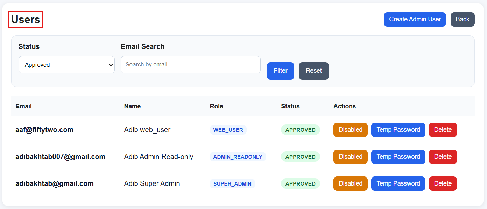
</p>

<p align="center">
  <em>Users page — manage registrations, approvals, status changes, and user actions.</em>
</p>
</details>

### 11.3 Create Admin User

Purpose:
- create `Super Admin` or `Admin Read-only` accounts

Flow:
1. open `Create Admin User`
2. enter full name
3. enter email
4. choose role
5. enter password
6. click `Create`

If the email exists in deleted state, the current logic may restore it.

<details>
<summary><strong>📸 View Create Admin User Screenshot</strong></summary>

<br>

<p align="center">
  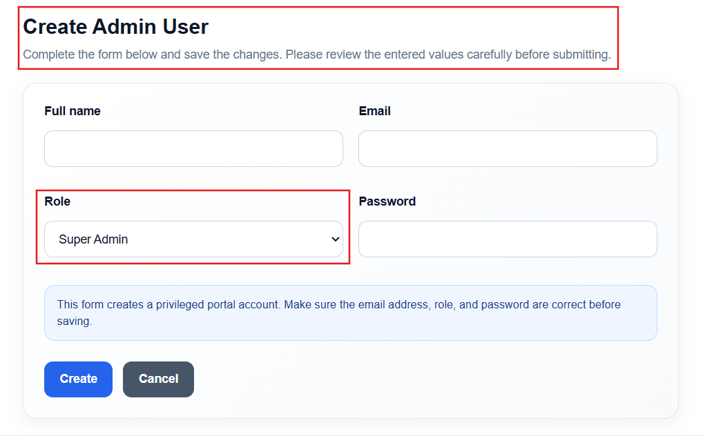
</p>

<p align="center">
  <em>Create Admin User page — create Super Admin or Admin Read-only accounts.</em>
</p>
</details>

### 11.4 Folders Page

Purpose:
- view indexed folders
- create folders
- upload files
- delete folders
- delete files

> **Important:** This page reads from the **database index**, not directly from disk.

If folders exist on disk but not in the database, they will not appear until a scan updates the DB.

<details>
<summary><strong>📸 View Folders Page Screenshot</strong></summary>

<br>

<p align="center">
  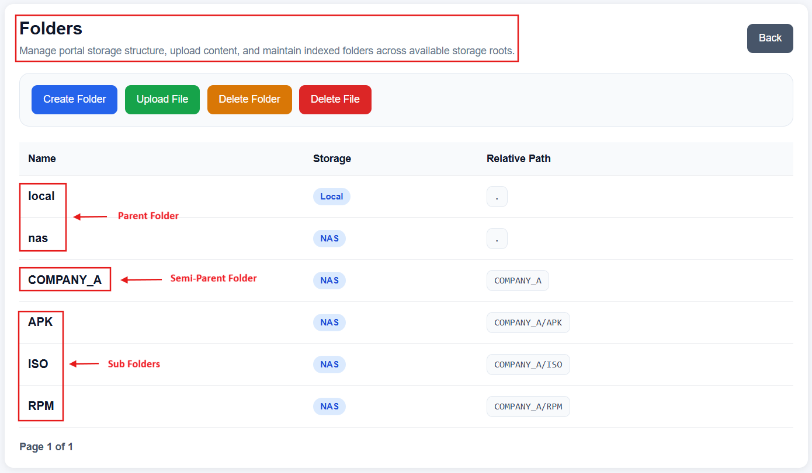
</p>

<p align="center">
  <em>Folders page — view indexed folders and manage storage-related operations.</em>
</p>
</details>

### 11.5 Create Folder

Purpose:
- create a new folder under a storage root

Flow:
1. open `Create Folder`
2. choose storage root
3. enter display name
4. enter relative path
5. click `Create`

Current behavior keeps the user on the same page after creation and shows success there.

<details>
<summary><strong>📸 View Create Folder Screenshot</strong></summary>

<br>

<p align="center">
  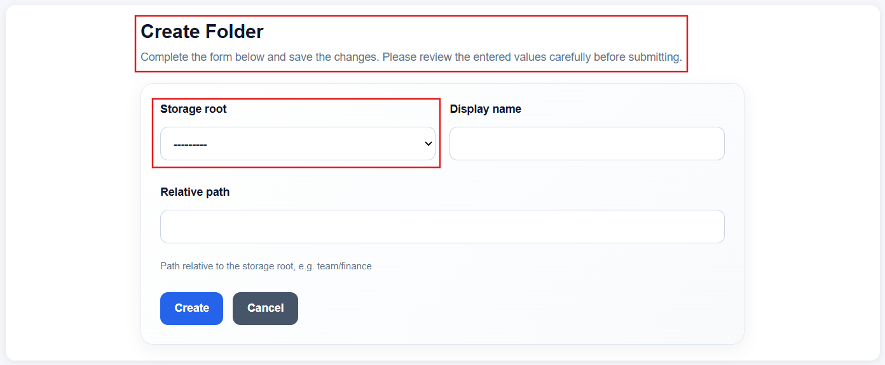
</p>

<p align="center">
  <em>Create Folder page — create a new folder under a selected storage root.</em>
</p>
</details>

### 11.6 Upload File

Purpose:
- upload one or multiple files into a selected folder

Supported behavior:
- multi-file upload
- total upload limit from `.env`
- client-side size validation popup
- server-side size validation

<details>
<summary><strong>📸 View Upload File Screenshot</strong></summary>

<br>

<p align="center">
  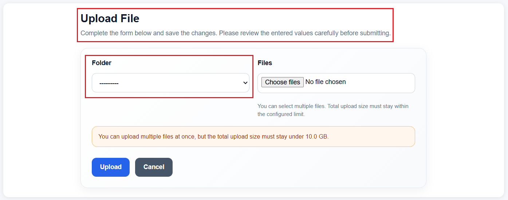
</p>

<p align="center">
  <em>Upload File page — upload one or multiple files into a selected folder.</em>
</p>
</details>

#### Upload Limit
Controlled by:

```env
FILEPORTAL_UPLOAD_MAX_BYTES=10737418240
```

Example above = **10 GB**

#### Infrastructure Requirements
Large uploads require:
- correct Nginx `client_max_body_size`
- correct Nginx `client_body_temp_path`
- enough disk space for temp upload area
- enough container storage
- properly aligned Gunicorn timeout

### 11.7 Delete Folder

Purpose:
- delete a folder from filesystem
- mark it inactive in DB

Rules:
- root folders cannot be deleted
- folder must be empty
- subfolders/files must be removed or moved first

<details>
<summary><strong>📸 View Delete Folder Screenshot</strong></summary>

<br>

<p align="center">
  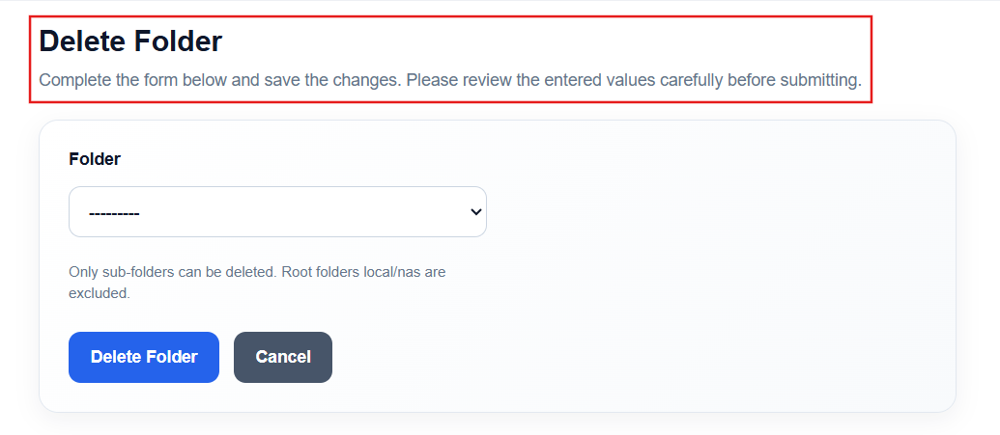
</p>

<p align="center">
  <em>Delete Folder page — remove folders safely based on current portal rules.</em>
</p>
</details>

### 11.8 Delete File

Purpose:
- delete a file from filesystem
- mark it inactive in DB

<details>
<summary><strong>📸 View Delete File Screenshot</strong></summary>

<br>

<p align="center">
  
</p>

<p align="center">
  <em>Delete File page — remove files from storage and mark them inactive in the database.</em>
</p>
</details>

### 11.9 Grant Folder Permissions

Purpose:
- assign folder access to users

Flow:
1. open `Grant Folder Permissions`
2. choose folder
3. choose user
4. click `Grant Read Access`

The page also supports:
- email search
- permission listing
- pagination

<details>
<summary><strong>📸 View Grant Folder Permissions Screenshot</strong></summary>

<br>

<p align="center">
  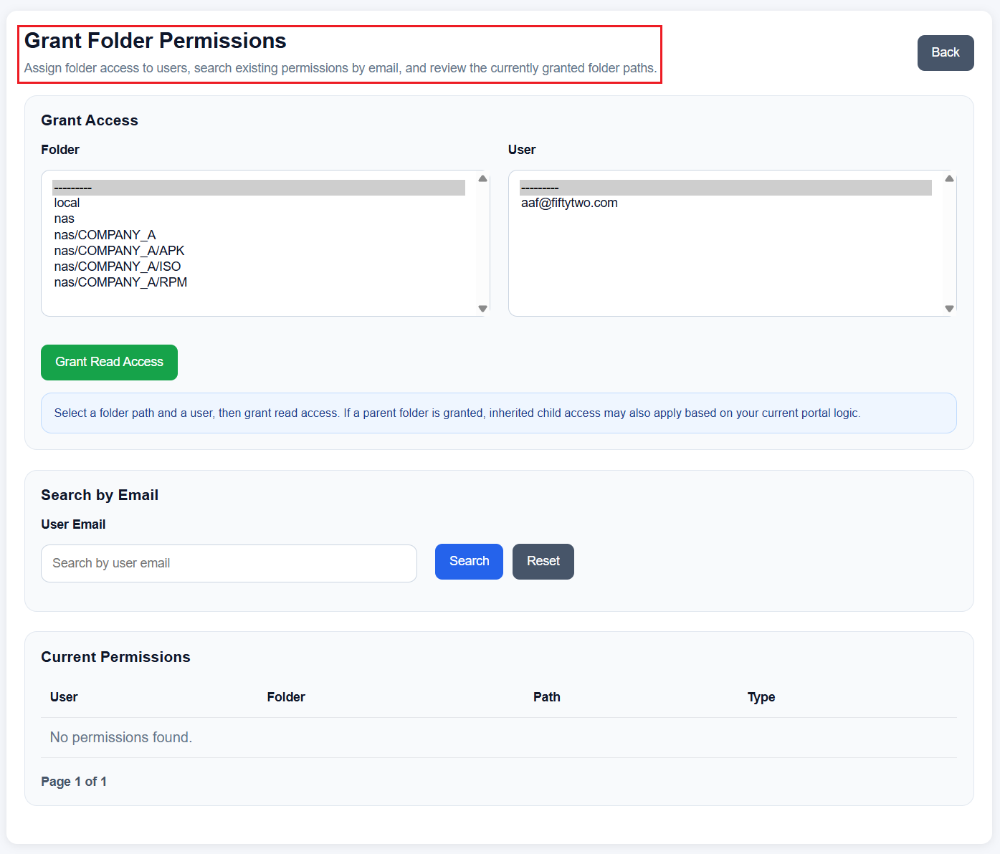
</p>

<p align="center">
  <em>Grant Folder Permissions page — assign folder access to selected users.</em>
</p>
</details>

### 11.10 Revoke Folder Permissions

Purpose:
- revoke user access to folders

Flow:
1. open `Revoke Folder Permissions`
2. locate permission row
3. click `Delete`

Depending on your recursive revoke logic, subtree access may also be removed.

<details>
<summary><strong>📸 View Revoke Folder Permissions Screenshot</strong></summary>

<br>

<p align="center">
  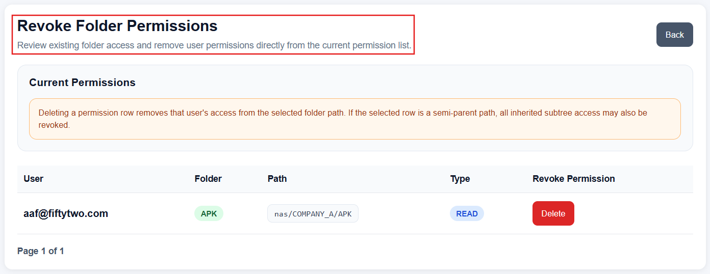
</p>

<p align="center">
  <em>Revoke Folder Permissions page — remove existing folder access from users.</em>
</p>
</details>

### 11.11 Audit Logs

Purpose:
- review security and operational events
- filter by Trace ID
- search by date
- search by date/time range
- drill into journey details

#### Trace ID
Trace ID groups related actions in one user journey, for example:
- login attempts
- OTP events
- portal actions
- logout-related events

<details>
<summary><strong>📸 View Audit Logs Screenshot</strong></summary>

<br>

<p align="center">
  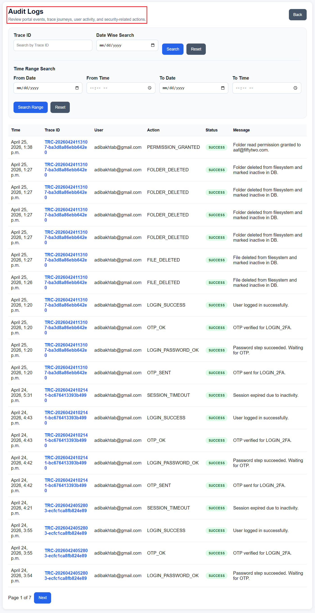
</p>

<p align="center">
  <em>Audit Logs page — review security and operational events with Trace ID tracking.</em>
</p>
</details>

---

## 12. Web User Portal Guide

### 12.1 Dashboard

Shows only folders that the user is allowed to access.

### 12.2 Folder Detail

Allows the user to:
- open a folder
- browse visible child folders
- view files

If unauthorized access is attempted:
- access is denied
- an audit event is created
- admin alert logic may trigger depending on configuration

### 12.3 Download File

Files are downloaded securely using:
- Django authorization
- Nginx protected internal redirect

Files are not exposed as public URLs.

### 12.4 Profile Page

Purpose:
- view user details
- view password expiry
- change password

Typically includes:
- full name
- email
- password expiry date

### 12.5 Change Password

Flow:
1. open profile
2. open change password page
3. enter current password
4. enter new password
5. confirm new password
6. enter OTP
7. submit

### 12.6 Forced Password Reset

Used when the user must change password before continuing.

---

## 13. Email & OTP System

The portal uses Celery tasks to send:

- login OTP
- unlock OTP
- password reminders
- password expiry alerts
- generic emails
- admin alert emails

### Normal Microsoft 365 SMTP Submission

```env
EMAIL_HOST=smtp.office365.com
EMAIL_PORT=587
EMAIL_USE_TLS=True
EMAIL_HOST_USER=your_mailbox@example.com
EMAIL_HOST_PASSWORD=your_password_or_app_password
DEFAULT_FROM_EMAIL=your_mailbox@example.com
```

> Do **not** use port `22` for SMTP.

### Microsoft 365 Relay Note

If you want passwordless sending through Microsoft 365 relay, use a proper Exchange Online relay/connector design with the correct relay host and typically port `25`, only after mail-flow connector configuration is completed.

---

## 14. Environment Variables

### Django
- `DJANGO_SECRET_KEY`
- `DJANGO_DEBUG`
- `DJANGO_ALLOWED_HOSTS`
- `DJANGO_CSRF_TRUSTED_ORIGINS`
- `DJANGO_SUPERUSER_EMAIL`
- `DJANGO_SUPERUSER_FULL_NAME`
- `DJANGO_SUPERUSER_PASSWORD`

### Database
- `DATABASE_NAME`
- `DATABASE_USER`
- `DATABASE_PASSWORD`
- `DATABASE_HOST`
- `DATABASE_PORT`

### Redis / Celery
- `REDIS_URL`
- `CELERY_BROKER_URL`
- `CELERY_RESULT_BACKEND`

### Email
- `EMAIL_HOST`
- `EMAIL_PORT`
- `EMAIL_USE_TLS`
- `EMAIL_HOST_USER`
- `EMAIL_HOST_PASSWORD`
- `DEFAULT_FROM_EMAIL`

### Portal Controls
- `FILEPORTAL_SESSION_TIMEOUT_MINUTES`
- `FILEPORTAL_OTP_EXPIRY_SECONDS`
- `FILEPORTAL_OTP_MAX_ATTEMPTS`
- `FILEPORTAL_UPLOAD_MAX_BYTES`
- `LOCAL_STORAGE_ROOT`
- `NAS_STORAGE_ROOT`
- `PROTECTED_NGINX_PREFIX`

---

## 15. Deployment & First-Time Setup

### 15.1 Prepare Host Paths

```bash
mkdir -p /deployment/local
mkdir -p /deployment/nas
mkdir -p /deployment/nginx_client_temp
```

### 15.2 Configure `.env`

Create `.env` and populate all required values.

### 15.3 Start the Stack

Using Podman Compose:

```bash
cd /deployment/Application/fileportal_prod
podman-compose up -d --build
```

Using Docker Compose:

```bash
cd /deployment/Application/fileportal_prod
docker compose up -d --build
```

### 15.4 Verify Containers

```bash
podman-compose ps
```

### 15.5 Verify Bootstrap

The `web` service automatically:
- applies migrations
- runs `collectstatic`
- seeds security questions
- creates initial superadmin

If needed, run manually:

```bash
podman-compose exec web python manage.py makemigrations accounts audittrail notifications settings_app storage_index portal_admin portal_user
podman-compose exec web python manage.py migrate
podman-compose exec web python manage.py seed_security_questions
podman-compose exec web python manage.py create_initial_superadmin
```

---

## 16. Storage Root & Scan Process

After a fresh database, folders may exist on disk but still not appear in the portal.

Why:
- folders/files are displayed from indexed DB rows
- `StorageRoot` rows must exist
- the scan must run

### Scheduled Scan
Celery Beat schedules `scan-storage-roots` every **600 seconds**.

### Manual Scan
```bash
podman-compose exec web python manage.py shell
```

Then:

```python
from storage_index.models import StorageRoot
from storage_index.services import scan_storage_root

for root in StorageRoot.objects.filter(is_active=True):
    scan_storage_root(root)
```

---

## 17. Branding & Static Files

For auth-page assets like the logo, keep them inside an app static path such as:

```bash
app/accounts/static/images/fiftytwo_logo.png
```

Then run:

```bash
podman-compose exec web python manage.py collectstatic --noinput
```

If the browser shows alt text instead of the image, usually the file exists in the source path but was not collected into `staticfiles`.

---

## 18. Useful Operational Commands

### Rebuild Stack
```bash
podman-compose up -d --build
```

### Check Web Logs
```bash
podman-compose logs --tail=100 web
```

### Check Celery Logs
```bash
podman-compose logs --tail=100 celery
podman-compose logs --tail=100 celery-beat
```

### Check Nginx Logs
```bash
podman-compose logs --tail=100 nginx
```

### Open Django Shell
```bash
podman-compose exec web python manage.py shell
```

### Collect Static Manually
```bash
podman-compose exec web python manage.py collectstatic --noinput
```

---

## 19. Troubleshooting

### 19.1 Login Says “Invalid credentials” After Rebuild

Possible cause:
- fresh database
- initial superadmin not created

Fix:

```bash
podman-compose exec web python manage.py create_initial_superadmin
```

### 19.2 OTP Logged as Sent but Email Not Received

Check:
- `.env` email host/port
- mailbox credentials
- Celery worker logs
- Microsoft 365 SMTP/relay setup

Working Microsoft 365 SMTP submission example:

```env
EMAIL_HOST=smtp.office365.com
EMAIL_PORT=587
EMAIL_USE_TLS=True
EMAIL_HOST_USER=your_mailbox@example.com
EMAIL_HOST_PASSWORD=your_password_or_app_password
DEFAULT_FROM_EMAIL=your_mailbox@example.com
```

### 19.3 Folders Exist on Disk but Not in Portal

Possible cause:
- fresh DB
- missing `StorageRoot` rows
- scan not run yet

Fix:
- ensure storage roots exist
- trigger manual scan
- verify Celery worker and beat are running

### 19.4 Large File Upload Fails

Check:
- `FILEPORTAL_UPLOAD_MAX_BYTES`
- Nginx `client_max_body_size`
- Nginx `client_body_temp_path`
- free space on temp path
- Gunicorn timeout
- Podman/container storage size

### 19.5 Podman Storage Fills `/var`

If Podman storage remains under `/var/lib/containers` and `/var` is small, rebuilds and large workloads can fail.

Recommended long-term fix:
- move Podman `graphroot` to `/deployment/containers/storage`
- keep Nginx temp uploads on `/deployment/nginx_client_temp`

---

## 20. Security Notes

Current security controls include:

- email-based authentication
- OTP verification
- password complexity
- password history checks
- password expiry
- account blocking and unlock flow
- session timeout middleware
- audit logging
- protected downloads via Nginx internal redirect

Before public exposure, additionally review:
- TLS certificate lifecycle
- reverse proxy hardening
- SMTP sender policy
- antivirus / content scanning if required
- rate limiting / WAF
- off-box log forwarding if required
- least-privilege container runtime settings

---

## 21. Maintenance Checklist

Regular checks should include:

- verify `web`, `celery`, `celery-beat`, and `nginx` are healthy
- verify OTP email delivery
- verify storage scans are running
- review audit logs
- review free disk space on:
  - `/var`
  - `/deployment`
  - container storage
  - Nginx temp upload path

---

## 22. Post-Deployment Validation Checklist

1. open login page
2. verify logo and static files load
3. log in as Super Admin
4. create Admin Read-only user
5. register a test Web User
6. approve the user from Users page
7. verify OTP delivery
8. verify folder scan is working
9. grant folder permission
10. log in as Web User
11. verify folder visibility and file download
12. verify audit log entries and Trace ID grouping
13. verify unlock flow
14. verify password change flow
15. verify large file upload behavior within configured limit

---

## Final Summary

This portal is **database-driven** for users, permissions, audit trails, and storage indexing.

That means:

- filesystem data alone is not enough after a DB reset
- user access depends on DB state
- portal folder visibility depends on indexed records
- OTP depends on Celery + SMTP
- downloads depend on Django authorization + Nginx protected paths

If you change infrastructure, mail flow, storage paths, or container storage, validate the full portal workflow again end to end.
